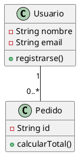

# testpuml

```plantuml
@startuml

class Usuario {
  - String nombre
  - String email
  + registrarse()
}

class Pedido {
  - String id
  + calcularTotal()
}

Usuario "1" -- "0..*" Pedido

@enduml
```
